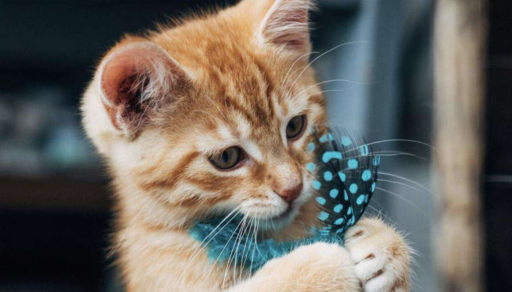

This was 5 Months ago but an interesting experiment regardless. its not everyday that you find some people willing to do amazing things, but that is exactly what [Hemi](https://www.torn.com/profiles.php?XID=2165616) and Burger (aka [Scarlett-X](https://www.torn.com/profiles.php?XID=2095421#/)) did 5 months ago  

_"Burger-Hemeow School for Kittens Who Want to Get Stronk But Don't Have the Proper Resources and Require Assistance."_   

**To figure out what exactly they did I decided to sit down with Hemi and Burger and they gave me a rundown**   

>"We made a [thread on the forums](https://www.torn.com/forums.php#/p=threads&f=13&t=16149166&b=0&a=0) asking (people) to "apply" for kitten training program for a month.  
They applied by filling out a quiz we made, with a variety of game questions. We picked the ones who looked active, needed the most help, and put thought into their reply  
We got 4. One of them turned out to be a multi and the other took all the free shit we gave and ran  
one quit midway because her parents didn't like her to be on internet. one was multi"   

Hemi and Burger spent a month teaching the kittens to play TORN, they gave them daily as well as weekly lessons on different TORN Topics alongside some Homework they had to do. kittens also had to do things and present it, so hemi and burger could verify if they did it or learned something   

Initially there were 18 out of which only 4 made it into the round. hemi and burger were looking for player's that were highly active, eager to learn with genuine interest in game, respectful towards other, stick around for 30 days and more importantly that had Good sense of Humor  

Most of the questions Hemi and Burger asked were trick questions

_The 2 that lasted the month program were really good and eager to learn One of them is still playing actively and making do The others donator pack expired and she refuses to fly to make money so she doesn't really play This is really making me want to do a round 2  >.<   We also had a detention room  When we found out someone was a multi we put her in detention room and made her confess_  

Burger Explains the purpose behind the experiment  
>it's like you get bored doing same shit again and again. the quest for gym stats is never ending. at the same time you see other people who are clueless and you remember your noob days. so we decided we will guide promising people so they don't commit mistakes which we did

they also shared their Disappointments during the experiment
>the main disappointment was the one who turned out to be a restart of someone and was using their wealth of previous account and Hoarding what we gave  
we told them that we reported them because they were having a 500k respect faction without a co leader  
She played dumb for a week or two, pretending to be a noob  
But she was a leader of a faction, had a high nw, and never flew
And would say stuff like, "so flying is good right? Ok, got it"

However even after some bad experiences with the experiment, the school might just return in the future  
>  We thought about doing it again and doing a better job vetting folks, but so far hadn't done a round 2. I fear that ppl pretend they need help just to get free shit and thats defeats the purpose of what we are doing
We both were bored and had money burning in our pockets. We like to help noobs casually but wanted to make an official thing and really set them up for success long term  
We'll have to do the vetting round differently next time. Like older age noobs should be considered, whereas before we were only looking at young accounts. But u run the risk of helping a multi or someone who won't stick around very long  
