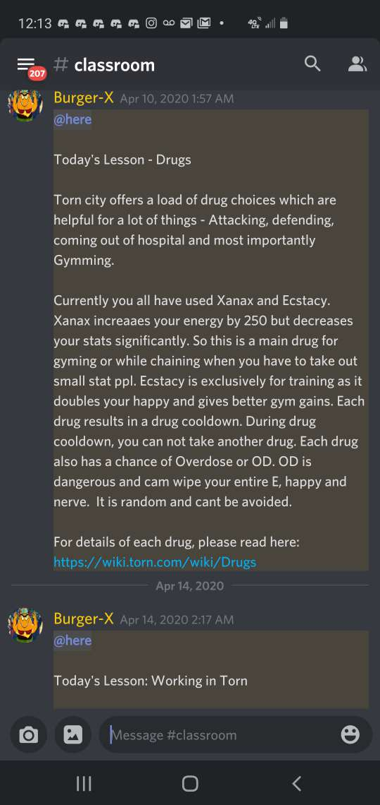
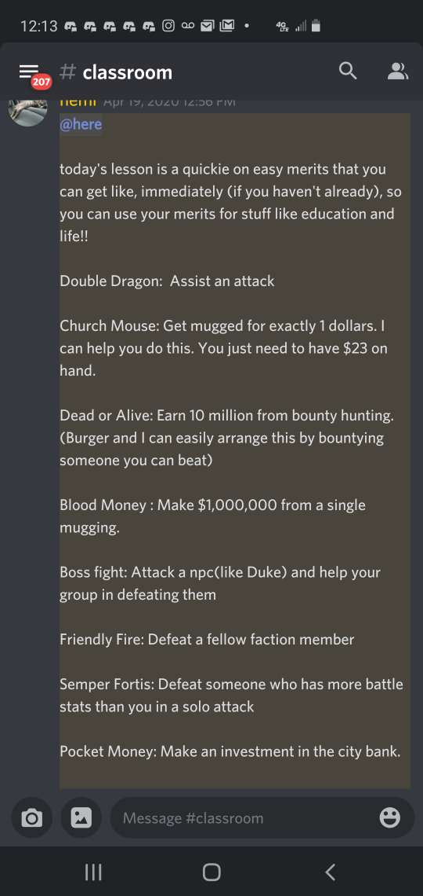
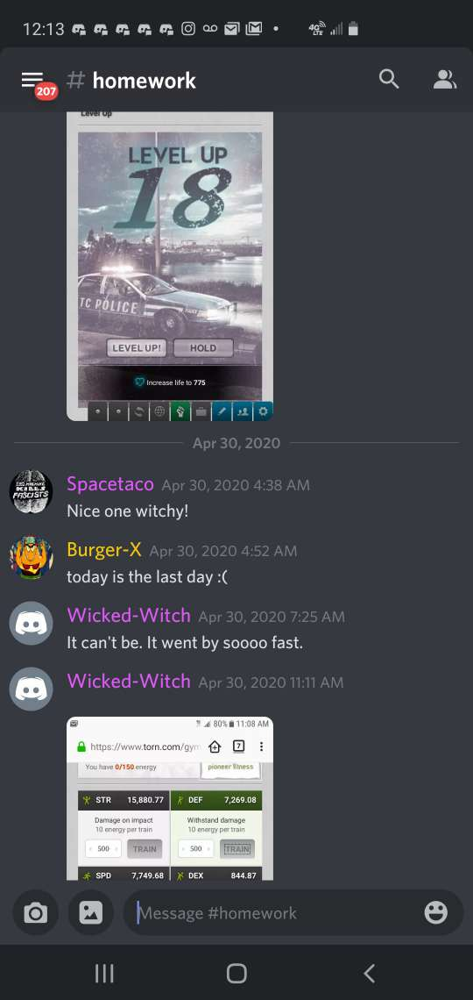

This happened about five months ago but it was an interesting enough experiment to merit an article. It's not every day that you find people doing wonderful things in the game, but that is exactly what [Hemi](https://www.torn.com/profiles.php?XID=2165616) and Burger (aka [Scarlett-X](https://www.torn.com/profiles.php?XID=2095421#/)) were doing!    

_"Burger-Hemeow School for Kittens Who Want to Get Stronk but Don't Have the Proper Resources and Require Assistance (B.H.K.W.W.G.S.D.H.P.R.R.A, yes, the abbreviation does suck.)"_   

**To figure out what exactly they did, I decided to sit down with Hemi and Burger, who gave me a detailed rundown!**   

>_"We made a [thread on the forums](https://www.torn.com/forums.php#/p=threads&f=13&t=16149166&b=0&a=0) requesting "applications" for the month-long kitten training program._  
_They application consisted of a quiz we made with a variety of game questions. We picked the ones who looked active, needed the most help, and put thought into their reply._  
_We picked four. One turned out to be a multi, another ran off with all the free shit we gave and the third quit midway because her parents didn't like her being on the internet."_   

Hemi and Burger spent a month teaching their 'kittens' to play TORN, giving them daily as well as weekly lessons on different TORN topics alongside some homework. Kittens also had to do assignments and present it, so Hemi and Burger could see if they were actually learning.   

Initially, there were 18, of which only 4 made it. Turns out players that were highly active, eager to learn with a genuine interest in the game, respectful towards others, would stick around for 30 days and more importantly, had good sense of humor weren't easy to find! Who would have thought?  

Most of the questions Hemi and Burger asked were trick questions.

>_The two that lasted the month were really active and eager to learn, one is still playing actively and making that dough. The other's donator pack expired and she refuses to fly for money, so she doesn't play anymore. This is making me want a second round.  >.<   We also had a detention room!  When we suspected one of being a multi, we put her in the detention room and even made her confess._  

Burger explains the purpose of their experiment.  
>It's like you get bored doing the same shit again and again. The quest for gym stats is never-ending. At the same time, you see other people who are clueless and you remember your noob days, so we decided that we'll guide promising people so they don't repeat our mistakes.

They also shared their disappointments during the experiment.
>The most disappointing was the one who turned out to be a restart, and was using their wealth from the previous account and hoarding what we gave.  
We told them that we reported them because they had a 500K respect faction without a co-leader.  
She played dumb for a week or two, pretending to be a noob but she was the leader of a faction, had a high net worth, never flew and would say stuff like, "So, flying is good right? Ok, got it."

However, even despite the bad experiences, they said the school might just return in the future.  
> We thought about doing it again and doing a better job of vetting folks, but so far haven't conducted a second round. I fear that people pretend they need help just to get free shit and that defeats the purpose of what we are doing.
We both were bored and had money burning in our pockets. We like to help noobs casually but wanted to make an official thing and set them up for success in the long term.  
We'll have to do the vetting round differently next time. Like older age noobs should be considered, whereas before we were only looking at young accounts. However, you always run the risk of helping a multi or someone who won't stick around very long.  

#### Thanks to  [Hemi](https://www.torn.com/profiles.php?XID=2165616/) and [Burger](https://www.torn.com/profiles.php?XID=2095421) for the interview and [Confused_Edd](https://www.torn.com/profiles.php?XID=2069481) for Editing. 
#### If you'd like to read more articles, go [here](https://torn.oran.pw).  
#### If you have an idea for an article in mind, join [TornHub Discord](https://discord.gg/yvNCTXB) and post in #article-suggestion channel or PM [ORAN](https://www.torn.com/profiles.php?XID=1778676) in-game.
#### Learn more about Tornhub [here](https://torn.oran.pw/welcome-to-tornhub/). Also, now you can **actually** keep track of our article releases via Discord in your own server [by following #article-release channel there](https://discord.gg/yvNCTXB). If you need help with doing that, please post on the #general channel and someone will help you out. See you at our next article!     

[Disclaimer: Quotes have been edited for accuracy and grammar purposes.]
